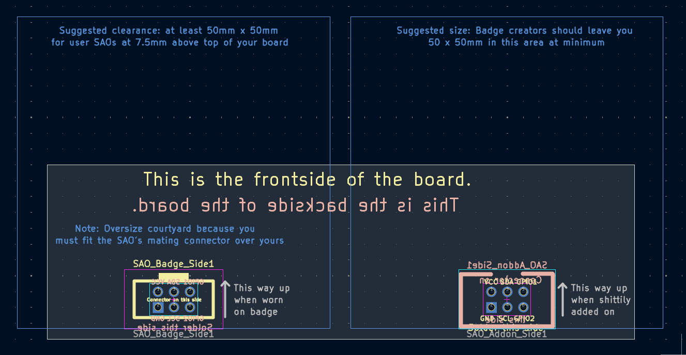
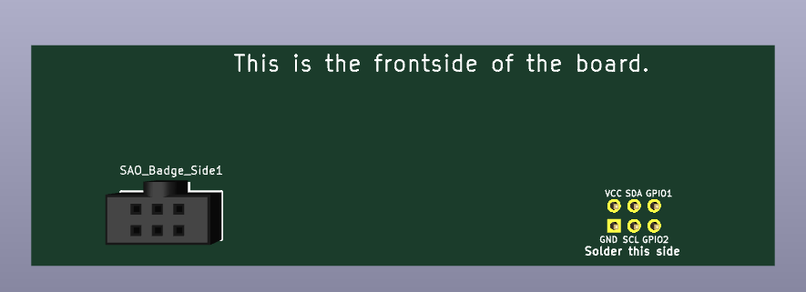
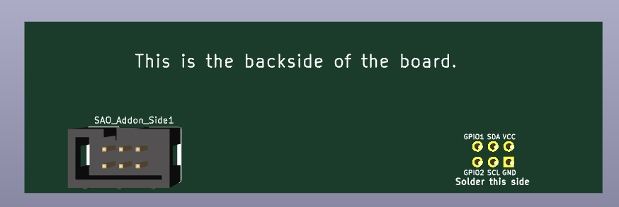

# SAO 2.0 KiCad Library

Requires **KiCad 10.0 or newer**.

This is a KiCad library implementing the [SAO 2.0 Standard](https://hackaday.io/project/175182-simple-add-ons-sao) *

*making VCC the marked square pin is silly, I changed it to GND, that's the only difference from the spec

This library includes symbols, footprints, and 3D models for designing badges and add-ons that use
the **SAO (Shitty Add-On) 2.0** connector standard: a 2x3, 2.54mm pitch IDC
header carrying `3V3`, `GND`, `SDA`, `SCL`, and two general-purpose pins.

Includes two parts (pick the one suited for your use):

| Symbol / Footprint | Use on |
|---|---|
| `SAO_Addon_Side` | Usually, exactly one of these goes on your SAO board |
| `SAO_Badge_Side` | One or more of these goes on a host badge |


## Install (recommended): via the Plugin and Content Manager

This is the easiest way to install and keep the library up to date.

1. Open KiCad → `Tools` → `Plugin and Content Manager`.
2. Go to the **Repositories** tab (or `Manage Repositories`) and add:
   ```
   https://raw.githubusercontent.com/aerospace-venoms/SAO-kicad-lib/main/pcm/repository.json
   ```
3. Switch to the **Repository** tab, find **SAO Connector Library**, click
   **Install**, then **Apply Pending Changes**.
4. Symbols, footprints, and 3D models are now available in every project.

PCM (KiCad's package manager) installs this footprint library under the nickname `PCM_SAO` by default. The footprint and 3d model are configured by default, so you don't need to change anything.

## Install (fallback): from a local copy

If you'd rather not add a repository, or you're offline:

1. Download/clone this repository.
2. Open KiCad → `Preferences` → `Manage Symbol Libraries...`
3. Click the folder icon (**Add existing library to table**) and select
   `symbols/SAO.kicad_sym`.
4. Open `Preferences` → `Manage Footprint Libraries...`
5. Click the folder icon and select the `footprints/SAO.pretty` folder.
   **Name the nickname `PCM_SAO`** (not `SAO`) so it matches the symbols'
   default footprint fields — same nickname the PCM install path produces.
6. Click OK on both dialogs, then close and reopen your project (or reload
   libraries) to pick up the new parts.

**Note on 3D models with this method:** the add-on-side model resolves
automatically (it points at KiCad's own bundled 3D model library). The
badge-side model (`SAO-Female-Connector.step`) won't show in the 3D viewer
unless you also copy `3dmodels/SAO.3dshapes/` into your KiCad 3rd-party
directory at `<3rd-party dir>/3dmodels/com_aerospace-venoms_sao/SAO.3dshapes/`
(find `<3rd-party dir>` under `Preferences` → `Configure Paths` →
`KICAD10_3RD_PARTY`). Symbols, footprints, and the PCB itself are unaffected
either way, this only affects the 3D preview/render.

## Footprints



## 3D Models

| Front | Back |
|---|---|
|  |  |

## Troubleshooting

- **Footprint missing / shows as "not found":** check your footprint
  library's nickname in `Manage Footprint Libraries`. It needs to be
  exactly `PCM_SAO` to match the symbols' default footprint fields. PCM
  installs use this nickname automatically; manual installs need it set by
  hand (see step 5 above).
- **3D model missing in the 3D viewer:** confirm `3dmodels/SAO.3dshapes/`
  installed alongside `footprints/` and `symbols/`. all three are part of
  the same package and always install together via PCM.


## Resources

There is a whole world of badge and SAO makers out there! Come find us and say 'hi'.

- [badge.life](https://badge.life/) — the badge-making community hub: a directory of badges, makers, and events, plus a running history of the #badgelife scene.
- [BadgeMakers Discord](https://discord.gg/kx87vuqgqN) — the most active real-time chat for badge and SAO design/fab questions, show-and-tell, and group buys.
- [SAO 2.0 Standard on Hackaday.io](https://hackaday.io/project/175182-simple-add-ons-sao) — the connector spec this library implements (see note above on the one intentional deviation).
- [KiCad Addons developer docs](https://dev-docs.kicad.org/en/addons/) — background on the PCM package format this repo follows, useful if you want to package your own badge/SAO library the same way.


## Contributing

### Repo layout

This repo is structured to match KiCad's PCM content-library package format
directly (see [KiCad Addons docs](https://dev-docs.kicad.org/en/addons/)):

```
symbols/SAO.kicad_sym
footprints/SAO.pretty/*.kicad_mod
3dmodels/SAO.3dshapes/*.step
resources/icon.png
metadata.json
pcm/                  # generated repository index (packages.json, repository.json, resources.zip)
```

`pcm/` is generated by `scripts/build_release.py` and committed by the
release GitHub Action — don't hand-edit it.

### Releasing a new version

Bump the version in `metadata.json`, then push a tag like `v1.1.0`. The
`release` GitHub Action builds the package zip, attaches it to a GitHub
Release, and regenerates `pcm/packages.json` and `pcm/repository.json` so
existing PCM users get the update automatically.

## License

[WTFPL](LICENSE) — do what you want with it.
