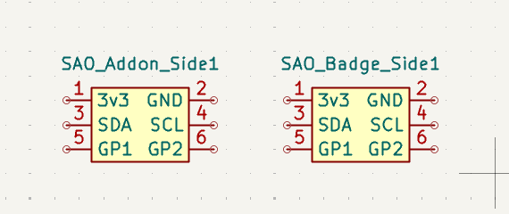
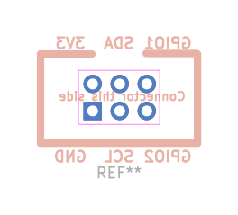
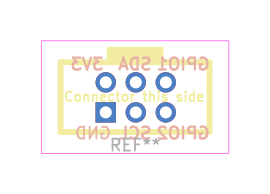

# SAO 2.0 KiCad Library

🤖 This project was created and maintained with machine assistance. 🤖

The original idea and guidance along the way was human.

Requires **KiCad 10.0 or newer**.

This is a KiCad library implementing the [SAO 2.0 Standard](https://hackaday.io/project/175182-simple-add-ons-sao) *

*making VCC the marked square pin is silly, I changed it to GND, that's the only difference from the spec

This library includes symbols, footprints, and 3D models for designing badges and add-ons that use
the **SAO (Shitty Add-On) 2.0** connector standard: a 2x3, 2.54mm pitch IDC
header carrying `3V3`, `GND`, `SDA`, `SCL`, and two general-purpose pins.

Includes two parts (pick the one suited for your use):

| Symbol / Footprint | Use on |
|---|---|
| `SAO_Addon_Side` | Usually, exactly one of these goes on your SAO board |
| `SAO_Badge_Side` | One or more of these goes on a host badge |




## Install via the Plugin and Content Manager

1. Open KiCad → `Tools` → `Plugin and Content Manager`.
2. Go to the **Repositories** tab  and click `Manage`. In that window, click the `+` button (botton-left) and enter this package's URL:
   ```
   https://raw.githubusercontent.com/aerospace-venoms/SAO-kicad-lib/main/pcm/repository.json
   ```
   Click `OK`, then `Save`. 
3. In the dropdown menu on the `Repository` tab, find `SAO Connector Library Repository`, go to the `Libraries` sub-tab, click
   `Install` on the SAO Connector Library, then `Apply Pending Changes`.
4. Close and re-open Kicad.
4. Symbols, footprints, and 3D models are now available in every project.

PCM (KiCad's package manager) installs this symbol library under `PCM_SAO` by default. The corresponding footprint and 3d model are configured by default, so you don't need to change anything once you've got the symbol in your schematic editor.

## Footprints

| `SAO_Addon_Side` | `SAO_Badge_Side` |
|---|---|
|  |  |

## 3D Models

Both parts include 3D models, so they'll render properly in the PCB editor's 3D viewer and in any 3D export of your board.

## Troubleshooting

- **Footprint missing / shows as "not found":** check your footprint
  library's nickname in `Manage Footprint Libraries`. It needs to be
  exactly `PCM_SAO` to match the symbols' default footprint fields. PCM
  installs use this nickname automatically; manual installs need it set by
  hand (see step 5 above).
- **3D model missing in the 3D viewer:** confirm `3dmodels/SAO.3dshapes/`
  installed alongside `footprints/` and `symbols/`. all three are part of
  the same package and always install together via PCM.


## Resources

There is a whole world of badge and SAO makers out there. Come find us! We want to trade!

- [badge.life](https://badge.life/) the badge-making community hub: a directory of badges, makers, and events, plus a running history of the #badgelife scene, mostly at DEF CON but some other conferences as well.
- [BadgeMakers Discord](https://discord.gg/kx87vuqgqN): the most active real-time chat for badge and SAO design/fab questions, show-and-tell, and group buys.
- [SAO 2.0 Standard on Hackaday.io](https://hackaday.io/project/175182-simple-add-ons-sao): the connector spec this library implements (see note above on the one intentional deviation).
- [KiCad Addons developer docs](https://dev-docs.kicad.org/en/addons/): background on the PCM package format this repo follows, useful if you want to package your own shared library the same way.


## Contributing

### Repo layout

This repo is structured to match KiCad's PCM content-library package format
directly (see [KiCad Addons docs](https://dev-docs.kicad.org/en/addons/)):

```
symbols/SAO.kicad_sym
footprints/SAO.pretty/*.kicad_mod
3dmodels/SAO.3dshapes/*.step
resources/icon.png
metadata.json
pcm/                  # generated repository index (packages.json, repository.json, resources.zip)
```

`pcm/` is generated by `scripts/build_release.py` and committed by the
release GitHub Action — don't hand-edit it.

### Releasing a new version

- Discuss the new version on the BadgeLife discord and reach consensus (this is more officially called "convene the SAO specification working group"). 
- Bump the version in `metadata.json`
- Push a tag like `v1.1.0`. The
`release` GitHub Action builds the package zip, attaches it to a GitHub
Release, and regenerates `pcm/packages.json` and `pcm/repository.json` so
existing PCM users get the update automatically.

## Credit where due:

- (TBD)

## License

[WTFPL](LICENSE) — do what you want with it.
